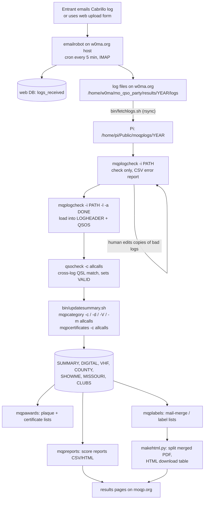

# moqputils: repo familiarization notes

Status: first pass, September 2026. Written while learning the code base. This file records how the Missouri QSO Party (MOQP) scoring tools work today, what they depend on, and what is still unknown. It does not propose fixes. Items that look like defects are listed as observations for later triage.

Sources used for this pass:

- this fork (`kawfey/moqputils`, `master` at `4868079`, identical to `N0SO/moqputils` `master`)
- read-only clones of Mike N0SO's other public MOQP repos
- the upstream issue tracker (`N0SO/moqputils` issues #59 to #70)
- the 2026 rules PDF from moqp.org

Not used: the scoring Pi (`http://moqp.n0so.net:20091/moqp/`), because this cloud environment can only reach HTTPS hosts through its proxy and the Pi serves plain HTTP on port 20091. No live run of the tools was done (see [What a live run needs](#what-a-live-run-needs)).

## Contents

1. [Summary](#summary)
2. [People and links](#people-and-links)
3. [Repo map](#repo-map)
4. [Contest-season pipeline](#contest-season-pipeline)
5. [Scoring logic in the code](#scoring-logic-in-the-code)
6. [Database](#database)
7. [CLI reference](#cli-reference)
8. [External dependencies](#external-dependencies)
9. [Mike's other MOQP repos](#mikes-other-moqp-repos)
10. [2026 rules compared to the code](#2026-rules-compared-to-the-code)
11. [State of the install and usage guide](#state-of-the-install-and-usage-guide)
12. [History and project state](#history-and-project-state)
13. [`w0ma` references](#w0ma-references)
14. [Observations noticed in passing](#observations-noticed-in-passing)
15. [What a live run needs](#what-a-live-run-needs)
16. [Open questions](#open-questions)

## Summary

- moqputils is a set of Python 3 command-line tools plus a MySQL/MariaDB database. The tools check Cabrillo logs, load them into the database, cross-check QSOs between logs, compute scores and categories, and produce CSV/HTML reports, award lists and mailing labels.
- The code in this repo cannot run by itself. Nearly every module imports `cabrilloutils`, which is not in any public repo. `devmodpath`, `htmlutils` and `qrzutils` are also missing. They probably live only on the Pi under `/home/pi/Projects/`.
- The database schema in the repo (`shared/sample-mqp-logsdb.sql`, May 2020) is out of date. The live schema exists only on the Pi and is carried forward each year by cloning the previous year's database in phpMyAdmin (see upstream issue #69).
- Year-specific values (contest dates, bonus windows, category IDs, file paths) are hard-coded in several files. Each new contest year needs edits in more than one place.
- There are no tests, no package metadata and no `requirements.txt`. The only usage guide (`shared/docs/INSTALLATION-USAGE.TXT`) dates from March 2020 and is partly stale.
- Code and 2026 rules agree on contest periods, QSO points, bonus stations and the low-band early bonus windows. Some differences need a decision from the committee (see [2026 rules compared to the code](#2026-rules-compared-to-the-code)).

## People and links

| Item | Value |
|---|---|
| Author and maintainer | Mike Heitmann, N0SO (all 387 upstream commits) |
| Current MOQP leads | Sterling (kawfey) and Kyle AA0Z |
| Sponsor (per 2026 rules) | BEARS-St. Louis; special event stations W0MA (BEARS, normally SLC) and K0GQ (Raytown ARC, JAC) |
| Contest web site | https://moqp.org/index.html/ (replaces https://w0ma.org/index.php/missouri-qso-party) |
| Scoring back end | Raspberry Pi, `http://moqp.n0so.net:20091/moqp/` |
| Upstream repo | https://github.com/N0SO/moqputils |
| Fork | https://github.com/kawfey/moqputils |
| Related fork | https://github.com/kawfey/cabrillolog (identical to upstream) |

Note on moqp.org: the site content is served under the path `/index.html/`. Relative links on the home page (for example `./results/thisyear/moqp-2026-rules-final.pdf`) resolve to `https://moqp.org/index.html/results/...`. The same paths without `/index.html/` return 404.

## Repo map

```
moqputils/                     (repo root)
├── README.md                  suite overview (2019 era), points to shared/docs
├── bin/                       command-line entry points (see CLI reference)
│   ├── mqplogcheck            check logs, optionally load into DB
│   ├── qsocheck               cross-log QSO validation in the DB
│   ├── mqpcategory            category + score, writes SUMMARY/DIGITAL/VHF/COUNTY
│   ├── mqpcertificates        SHOWME / MISSOURI award tables
│   ├── mqpreports             CSV/HTML score reports, log delete, error stats
│   ├── mqpawards              plaque and certificate winner lists
│   ├── mqplabels              label / mail-merge lists for awards
│   ├── makehtml.py            split merged certificate PDF, emit HTML download table
│   ├── csv2cab                MOQP_log.xls CSV export to Cabrillo
│   ├── fixoldloggers          strip serial-number fields from old WriteLog logs
│   ├── updatelog              old loader entry point (points to missing modules)
│   ├── logrobot               wrapper for N0SO/emailrobot
│   ├── fetchlogs.sh           rsync submitted logs from the w0ma.org host to the Pi
│   ├── updatesummary.sh       runs the mqpcategory/mqpcertificates "allcalls" passes
│   ├── mqpdevpath.py          adds /home/pi/Projects paths to sys.path
│   └── sample_setpath         sample shell PATH setup
├── moqputils/                 library package (about 9,700 lines)
│   ├── configs/contestdates.py  contest periods (UTC), imported by cabrilloutils
│   ├── sample-moqpdbconfig.py   DB credentials template (copy to configs/moqpdbconfig.py)
│   ├── moqpdefs.py            counties, states, DX, modes, categories, CSV headers
│   ├── moqplogfile.py         Cabrillo file to dict (HEADER, QSOLIST)
│   ├── moqpqsoutils.py        QSO parse, per-QSO validation, score formula, header review
│   ├── moqpcategory.py        file-based check: dupes, mults, bonuses, category string
│   ├── moqplogcheck.py        mqplogcheck back end (report, move accepted files)
│   ├── moqploadlogs.py        load checked logs into LOGHEADER/QSOS
│   ├── moqpdbutils.py         DB access layer (MySQLdb)
│   ├── moqpqsovalidator.py    cross-log QSL matching (qsocheck)
│   ├── dupecheck.py, moqpmults.py, bonusaward.py, lowbandbonus.py
│   ├── moqpdbcategory.py      DB-based scoring, writes SUMMARY, category IDs
│   ├── moqpdbdigital.py / moqpdbvhf.py / moqpdbcountyrpt.py   award sub-tables
│   ├── showmeaward.py, missouriaward.py, bothawards.py, moqpcertificates.py,
│   │   moqpdbcertificates.py  SHOWME / MISSOURI 1x1 awards
│   ├── moqpdb*report.py, moqphtmlreport.py, logreport.py, countylineops.py,
│   │   moqpqsoerrorstats.py, deletelog.py   reports and admin helpers
│   ├── moqpAwards/            2026 rework of plaques, certificates, state awards, labels
│   ├── moqplabels.py, showmelabels.py, moqpawardefs.py   older label code and award defs
│   └── gui_moqpcategory.py, fixoldloggers.py
├── logchecker/, ui/           Tk/GTK GUI for log checking (partial)
├── makehtml/                  older copy of the certificate HTML helper
├── phpfiles/                  web side (w0ma.org era)
│   ├── logsubmission/         web upload form (reCAPTCHA), emails log to the robot mailbox
│   ├── countyform/            "which counties will you activate" planner + map
│   └── results/2019..2022/    per-year "logs received" and "active counties" pages
└── shared/
    ├── docs/INSTALLATION-USAGE.{TXT,odt}   2020 install and scoring guide
    ├── multlists/             multiplier lists (counties, states, DX/provinces, ARRL sections)
    ├── sample-mqp-logsdb.sql  2020 scoring DB schema
    └── sample-logsreceived-w0ma_moqp.sql   2020 web-side DB schema
```

## Contest-season pipeline

The flow below comes from the `bin/` scripts, `bin/updatesummary.sh`, `bin/fetchlogs.sh`, the install guide and N0SO/emailrobot. It is not yet confirmed against how Mike ran the 2026 season.



| Step | Command | Reads | Writes |
|---|---|---|---|
| Pre-check | `mqplogcheck -i <file or dir> [-a <accepted dir>] [-b]` | log files | stdout CSV; moves clean logs to `-a` dir |
| Load | `mqplogcheck -i <dir> -l [-a <dir>] [-b] [-u] [-e]` | log files | `LOGHEADER`, `QSOS` (dupes marked at load) |
| Cross-check | `qsocheck -c allcalls` (or a call) | `LOGHEADER`, `QSOS` | `QSOS.VALID/QSL/NOLOG/NOQSOS/NOTE` |
| Score | `mqpcategory -c allcalls` | `LOGHEADER`, `QSOS` (VALID=1) | `SUMMARY` |
| Sub-awards | `mqpcategory -d / -V / -m allcalls` | `QSOS`, `SUMMARY` | `DIGITAL`, `VHF`, `COUNTY` |
| 1x1 awards | `mqpcertificates -c allcalls` | `QSOS` | `SHOWME`, `MISSOURI` |
| Reports | `mqpreports -c allcalls|club|club-update|club-summary [-t html]` etc. | summary tables | stdout; `club-update` writes `CLUBS`, `CLUB_MEMBERS` |
| Awards | `mqpawards -a create-table`, `-a 1`, `-c create-table`, `-c 1|2`, `-p ...`, `-s`, `-m` | summary + award tables | `FIRSTPLACE`, `AWARDS`, `STATELIST`/state tables |
| Labels | `mqplabels -c | -s | -m | -p` | award tables, `LOGHEADER` addresses | stdout TSV |
| Certificate web page | `makehtml.py -c <list.tsv> -f <merged.pdf>` | TSV from `mqplabels`, merged PDF | `downloads/*.pdf`, HTML table on stdout |

## Scoring logic in the code

### QSO parsing and per-QSO checks (`moqpqsoutils.py`)

Each `QSO:` line must have 10 fields: `FREQ MODE DATE TIME MYCALL MYRST MYQTH URCALL URRST URQTH`. Date and time become one `DATETIME` object. A QSO is marked `ERROR` (invalid) when:

- `FREQ` is not a number (a frequency outside a band is recorded as a note but does not make the QSO invalid),
- `MODE` is not in `moqpdefs.MODES`,
- the date/time is outside the periods in `configs/contestdates.py` (checked by `cabrilloutils`),
- a call has characters outside `A-Z 0-9 / -`,
- an RST is not numeric (a 2-digit RST on CW/digital or a 3-digit RST on phone is only a warning, per upstream issue #4),
- `MYQTH` or `URQTH` is not a Missouri county code, US state/section, Canadian code or DX entry.

Header review (`headerReview`) requires a known `CONTEST:` name, a valid `LOCATION:`, all four of `CATEGORY-STATION/OPERATOR/POWER/MODE`, a `CALLSIGN:` and a valid `EMAIL:`. A log loads only if the header passes and all invalid QSOs are dupes, unless `-e` (accept errors) is given.

### Dupes (`dupecheck.py`)

Two valid QSOs are dupes when the stripped `URCALL`, band, raw `MODE` string, `URQTH` and `MYQTH` all match. The later QSO gets `DUPE = <QID of earlier QSO>` and becomes invalid. This matches the rule "once per mode per band per Missouri county".

### Cross-log QSL check (`moqpqsovalidator.py`, run by `qsocheck`)

For each non-dupe QSO whose `MYCALL` matches the log header:

| Condition | Result in `QSOS` |
|---|---|
| Other station's log is in the DB and has a QSO back with time within 30 minutes, same band, same mode group, `URQTH` equal to their `MYQTH` (DX prefixes normalized), and matching RST (or their RST is malformed) | `VALID=1`, `QSL=<their QSO ID>` |
| Other station's log is in the DB but no matching QSO | `VALID=0`, `NOQSOS=1`, note "No matching QSO in X log." |
| Other station sent no log | `VALID=1`, `NOLOG=1`, note "No log received from X." |
| QSO failed per-QSO checks | `VALID=0`, note lists the errors |
| `MYCALL` differs from header call | `VALID=0` |

The mismatch cause codes in `checkThisqso` are 1 time, 2 band, 3 mode, 4 QTH.

### Multipliers (`moqpmults.py`)

`MOQPMults` loads three lists from `/usr/local/share/moqputils/multlists/` (`moqp-counties.csv`, `moqp-us-states.csv`, `moqp-dx.csv`; copies are in `shared/multlists/`) and counts each distinct `URQTH` found in them. The counting itself is in `cabrilloutils.contestmults.ContestMults` (not available). `MOQPMults_E` adds the 2026 "50-QSO county activation" credit: for `MOBILE`, `PORTABLE` or `ROVER` entries, each Missouri county with 50 or more valid QSOs from it (`GROUP BY MYQTH`) is added as a multiplier (upstream issue #67).

### Score formula (`MOQPQSOUtils.calculate_score`)

```
QSO points  = 2*CW + 2*DIGITAL + 1*PHONE + LBE
score       = QSO points * mults + 100*[W0MA worked] + 100*[K0GQ worked] + 100*[Cabrillo bonus]
LBE         = min(250, count of valid 40 m / 80 m QSOs 1400-2000 UTC on each contest day)
```

- `LBE` is the 2026 low-band early-day bonus (`lowbandbonus.py`, issue #66). The day windows and the 250 cap are hard-coded for 2026 in that file.
- `SUMMARY.QSOSCORE` stores QSO points times mults without bonuses and without `LBE`. `SUMMARY.SCORE` is the full score.
- The Cabrillo bonus flag comes from the `-b` option at load time and is stored in `LOGHEADER.CABBONUS`.
- VHF QSOs are those with `FREQ >= 50000` kHz or a Cabrillo band token (for example `144`, `1.2G`).

### Category string and category ID (`moqpcategory.py`, `moqpdbcategory.py`)

`determineMOQPCatstg` builds a name such as `MISSOURI FIXED SINGLE-OP LOW POWER` or `US SINGLE-OP QRP POWER` from `LOCATION` and the `CATEGORY-*` tags. `ROVER` maps to `PORTABLE`. High-power mobile/portable entries become `... UNLIMITED`. `_MOQPCatTable` then maps the category to a hard-coded ID in the database table `CONTESTCATEGORIES`:

| ID | Category | ID | Category |
|---|---|---|---|
| 1 | MO Fixed Multi-Op | 14 | MO Portable Unlimited |
| 2-4 | MO Fixed Single-Op High / Low / QRP | 15 | MO Portable Multi-Op Low |
| 5 | MO Expedition Multi-Op | 16-18 | MO Portable Single-Op Low Mixed / CW / Phone |
| 6-8 | MO Expedition Single-Op High / Low / QRP | 19 | Canada |
| 9 | MO Mobile Unlimited | 20-22 | US Single-Op High / Low / QRP |
| 10 | MO Mobile Multi-Op Low | 23 | US Multi-Op |
| 11-13 | MO Mobile Single-Op Low Mixed / CW / Phone | 24 | DX |
| 25 | Checklog | 26 | MO School |

`SUMMARY.MOQPCAT` holds the string and `SUMMARY.MOQPCTAB` holds the ID. ROOKIE, DIGITAL and VHF are flags in `SUMMARY` beside the main category.

### SHOWME / MISSOURI 1x1 awards

`showmeaward.py`, `missouriaward.py` and `bothawards.py` look for 1x1 calls `K0x`, `N0x`, `W0x` whose suffix letters spell SHOWME (6 letters) or MISSOURI (8 letters). W0MA and K0GQ act as wild cards for one missing letter. Results go to the `SHOWME` and `MISSOURI` tables (one column per letter, `WC`, `QUALIFY`).

## Database

### Tables and who writes them

| Table / view | Created by | Written by | Read by |
|---|---|---|---|
| `LOGHEADER` | sample SQL only | `moqpdbutils.write_header` (load) | almost everything |
| `QSOS` | sample SQL only | `write_qsolist` (load), `moqpqsovalidator` (qsocheck) | scoring, reports, bonuses |
| `SUMMARY` | `moqpdbutils.doesSUMMARYExist` (IF NOT EXISTS) | `writeSummary` (mqpcategory -c) | reports, awards, labels |
| `DIGITAL`, `VHF`, `COUNTY` | `moqpdbdigital`, `moqpdbvhf`, `moqpdbcountyrpt` | mqpcategory -d / -V / -m | reports, awards |
| `SHOWME`, `MISSOURI` | `moqpdbcertificates` (IF NOT EXISTS) | mqpcertificates -c | reports, labels |
| `CLUBS`, `CLUB_MEMBERS` | `moqpdbclubreport` | `mqpreports -c club-update` | club reports, awards |
| `FIRSTPLACE` | `moqpAwards/CATEGORYPlaques` | `mqpawards -a create-table` | plaque lists |
| `AWARDS` | `moqpAwards/CATEGORYAwards` | `mqpawards -c create-table` | certificate lists, labels |
| `STATELIST` and a state results table | `moqpAwards/stateAwards` | `mqpawards -p create-table / update-list` | state/province lists |
| `CONTESTCATEGORIES`, `PLAQUES`, `CERTIFICATES`, `PLAQUESLIST`, `MULTIAWARD` | **not defined in the repo** | manual (phpMyAdmin) | awards code |
| `FIRSTPLACE_VIEW`, `COUNTYACTIVE_VIEW` | **not defined in the repo** | manual views | older plaque code, counties-worked report |

The web side uses a second database (sample in `shared/sample-logsreceived-w0ma_moqp.sql`) with `logs_received`, `stations_registered`, `routes`, `route_entries` and `mocounties`. `emailrobot` writes `logs_received`; the county form writes the route tables.

### Differences between the sample schema and the code

- `QSOS` in the sample has `DATE` and `TIME` strings. The loader writes a `DATETIME` column, and `lowbandbonus.py` and `moqpqsovalidator.py` read it.
- `SUMMARY` in the sample lacks `LBNDEARLY`, `ACTIVATED50`, `ACTIVATED` and `MOQPCTAB`, and still has `LOCATION` (removed by upstream issue #2). Because the code creates `SUMMARY` only `IF NOT EXISTS`, a DB built from the sample would keep the old columns and the 2026 `writeSummary` would fail.
- The five reference tables and two views marked **not defined in the repo** above are absent from the sample.
- Each year the live database is cloned from the year before in phpMyAdmin. Issue #69 records that views keep the old database name after a clone, which is why the 2026 code moved from views to direct queries.

A structure-only dump (`mysqldump --no-data`) of the 2026 database on the Pi would be the reference schema for any new setup.

## CLI reference

Options come from each script's `argparse` definition. Most tools try to start a GUI when run with no options; several of those GUI modules are missing (see [External dependencies](#external-dependencies)).

| Tool (version) | Options | Back-end module |
|---|---|---|
| `mqplogcheck` (0.1.1) | `-i PATH` file or dir; `-a DIR` move accepted logs; `-b` Cabrillo bonus; `-l` load into DB; `-u` replace an existing log; `-e` load even with errors | `moqplogcheck.MOQPLogcheck`, `moqploadlogs.MOQPLoadLogs` |
| `qsocheck` (0.1.2) | `-c CALL` or `-c allcalls` | `moqpqsovalidator.MOQPQSOValidator` |
| `mqpcategory` (0.1.6) | `-i PATH` (file-based, no DB); `-c CALL|allcalls` SUMMARY; `-d` DIGITAL; `-V` VHF; `-m` COUNTY; `-s CALL` SHOWME/MISSOURI; `-b` Cabrillo bonus | `moqpcategory`, `moqpdbcategory`, `moqpdbdigital`, `moqpdbvhf`, `moqpdbcountyrpt`, `moqpdbcertificates` |
| `mqpcertificates` (0.1.1) | `-c CALL|allcalls`; `-i PATH` | `moqpdbcertificates`, `moqpcertificates` |
| `mqpreports` (1.0.0) | `-c CALL|allcalls|club|club-update|club-summary`; `-a CALL` county-line ops with `-n 2..4`; `-l CALL` log report; `-d` digital; `-V` VHF; `-C` counties worked; `-m CALL|allcalls` most counties; `-s showme|missouri`; `-D CALL` delete log; `-e CALL` QSO error stats; `-t csv|html` | `moqpdbcatreport`, `moqpdbclubreport`, `countylineops`, `logreport`, `moqpdbcountycount`, `moqpdbdigitalreport`, `moqpdbvhfreport`, `moqpdbcountyrpt`, `moqpdbcertificates`, `deletelog`, `moqpqsoerrorstats` |
| `mqpawards` (1.0.2) | `-a 1|2|create-table` plaques; `-c 1|2|create-table` certificates; `-s` SHOWME; `-m` MISSOURI; `-p 1|2|create-table|update-list` state/province; `-t csv|html` | `moqpAwards.*` |
| `mqplabels` (0.2.1 in code, 1.0.0 in history) | `-c` category; `-s` SHOWME; `-m` MISSOURI; `-p` state/province | `moqpAwards.*` |
| `makehtml.py` (0.2.0) | `-c LIST.tsv`; `-f MERGED.pdf` | standalone, needs `pypdf` |
| `csv2cab` | `-i FILE.csv` | `cabrilloutils` |
| `fixoldloggers` (0.0.1) | `-i FILE` | `moqputils.fixoldloggers` |

## External dependencies

| Dependency | Used for | Where it is |
|---|---|---|
| `cabrilloutils` (`CabrilloUtils`, `qsoutils.QSOUtils`, `contestmults.ContestMults`, `generalaward.GenAward`, `common`) | Cabrillo parsing, band lookup, date checks, callsign strip, mults, award base class | **not public**; likely `/home/pi/Projects/` on the Pi |
| `devmodpath` | `sys.path` setup in `qsocheck`, `mqpcategory` | **not public** |
| `htmlutils` (`htmldoc`, `htmltable`, `htmlreports`) | HTML reports | **not public** |
| `qrzutils.qrz.qrzlookup` | QRZ.com lookups for labels | **not public**; probably wraps `N0SO/pyQRZ` (public fork, package `qrz`) |
| `emailrobot` | `bin/logrobot` | public: `N0SO/emailrobot` |
| `MySQLdb` (mysqlclient) | all DB access | PyPI |
| `pypdf` | `makehtml.py` | PyPI |
| `tkinter`, `gi` (GTK) | GUIs | OS packages |
| `moqputils/configs/moqpdbconfig.py` | DB host, user, password, name | local file made from `moqputils/sample-moqpdbconfig.py`; git-ignored by convention |

GUI modules imported but not present in the repo: `gui_reports`, `showme_ui`, `moqploadlogs_ui`, `moqputils.gui_reports`.

Path handling: scripts add `/home/pi/Projects` and `/home/pi/Projects/moqputils` to `sys.path` (`bin/mqpdevpath.py`, `devModPath` calls). Some modules use short imports such as `from bonusaward import BonusAward` (in `moqpdbcategory.py`), which work only when `moqputils/moqputils` is also on `sys.path`. Multiplier lists are read from the absolute path `/usr/local/share/moqputils/multlists/`.

## Mike's other MOQP repos

All public, all by N0SO, cloned read-only for this review. None are forked yet.

| Repo | Last commit | Role |
|---|---|---|
| `emailrobot` | 2026-03-12 | Log intake. Runs from cron every 5 minutes on the w0ma.org cPanel host, reads the MOQP mailbox over IMAP, checks the attachment with `CabrilloFilter` (needs `cabrilloutils`), saves it, adds a row to `logs_received`, and replies to the sender. The web upload form sends its log to the same mailbox with subject `MOQP WEB <call>`. Has a branch `1-updating-code-for-the-new-moqporg-server`. |
| `cabrillolog` | 2024-05-17 | Newer Cabrillo classes (`logfile`, `cabheader`, `qso`); also imports `cabrilloutils`. |
| `certificateserver` | 2026-05-23 | Flask app that serves award certificates from a template and a TSV file. |
| `moqpmaps` | 2026-03-23 | OpenStreetMap county activation and route planning (linked from moqp.org as `mqpmaps`). |
| `status1x1` | 2026-01-22 | Scrapes 1x1callsigns.org for this year's 1x1 special event stations into the MOQP DB. |
| `contestorphans` | 2024-05-17 | Lists calls in QSOs that have not sent a log. |
| `soapbox` | 2026-04-17 | Web page of soapbox comments from the DB (upstream issue #65). |
| `rookiereport`, `onebyoneselogs`, `reverselog` | 2024 | Rookie summary, 1x1 log-received status, reverse Cabrillo log from the DB. |
| `pyQRZ` | 2020-02-27 | Fork of a QRZ XML API client. |

## 2026 rules compared to the code

Source: `moqp-2026-rules-final.pdf` from moqp.org.

| Rule item | 2026 rules | Code | Agree? |
|---|---|---|---|
| Periods | 11 Apr 1400Z to 12 Apr 0400Z; 12 Apr 1400Z to 2000Z | `configs/contestdates.py` same values | yes |
| Bands | 160 m to 10 m (no WARC), 6 m, 2 m, 1.25 m, 70 cm | band check in `cabrilloutils` (not visible); `HIGHBANDS` also lists microwave bands (issue #68) | cannot confirm |
| QSO points | phone 1, CW 2, digital 2 | same | yes |
| W0MA, K0GQ bonus | 100 each, first QSO only | 100 each if worked | yes |
| Cabrillo bonus | still listed as item 6 (100 points) | still applied when `-b` is set | yes, but upstream issue #70 says the bonus ended with the 2026 rules |
| Low-band early bonus | +1 per valid 40/80 m QSO 1400-2000Z each day, "up to 250-point bonus can be added to the total score" | count (max 250) added to QSO points before the multiplier | **interpretation differs**: code multiplies the bonus by mults |
| Mults, MO stations | counties (115) + states (49) + provinces/territories (13) + 1 if any DX | one pool of counties, states and a DX/province list | cannot confirm (logic in `cabrilloutils`) |
| Mults, non-MO and DX | MO counties only | same pool; non-MO stations only work MO stations | probably |
| 50-QSO county credit | mobile or portable entries | `MOBILE`, `PORTABLE`, `ROVER` | yes |
| Dupes | once per mode per band per county | same fields, raw mode string | mostly (see observations) |
| Digital | one QSO per station per band across all digital modes; FT4/FT8 not allowed | FT8 and FT4 are valid modes in `moqpdefs.MODES` | **differs** |
| Cross-band / cross-mode | not permitted | QSL match requires same band and mode | yes |
| Plaques | first place with 50+ QSOs; Expedition is one plaque | digital plaque query uses `QSOS > 49`; plaque list lives in DB tables | partly visible |
| Tie break | most MO counties; most-counties award goes to earliest last-county time | `COUNTY` table keeps last new county and time (mqpreports V0.1.4) | yes |
| Holt County code | Table 1 prints `HTL` | `HLT` in `moqpdefs.py`, `shared/multlists` and the 2020 web DB | **differs** (maybe a typo in the PDF) |
| Province codes | AB BC MB NB NL NS NT NU ON PE QC SK YT | `moqp-dx.csv`: AB BC LAB MB NB NF NW NS ON PEI QU SK YT DX; `moqpdefs.CANADA` uses ARRL section codes | **differs** |
| Log submission | web site and `moqsoparty@w0ma.org`; certificates from `www.w0ma.org` | same addresses in PHP | rules PDF still points to w0ma.org |

## State of the install and usage guide

`shared/docs/INSTALLATION-USAGE.TXT` (March 2020) still gives a sound picture of the season, but these parts are stale:

- `loadlogs` does not exist any more. Loading is `mqplogcheck -i <path> -l` (with `-u` to replace a log, which the guide says is missing).
- `mqpcategory -U` is now `-V`, and `-C/--county` is now `-m/--mostcounties`.
- `mqpcategory -d/-V/-m` now write the `DIGITAL`, `VHF` and `COUNTY` tables (the guide says "no updates").
- `mqpawards`, `mqplabels`, `makehtml.py`, club updates and the `moqpAwards` tables are not described.
- It does not mention the missing packages, the multlist install path or `configs/moqpdbconfig.py`.
- Example paths (`/home/data/moqploags/`) and the 2019 exchange example are out of date.

## History and project state

- Upstream history: 387 commits from 2018-09-18 to 2026-05-11. Commits per year: 2018 11, 2019 103, 2020 113, 2021 64, 2022 34, 2023 15, 2024 2, 2025 8, 2026 37. This container has a shallow clone (105 commits).
- The code started as `csv2cab` (2018), scored its first full party in 2019, and was restructured in 2020-2021 (DB loader, QSL validator, shared `MOQPQSOUtils`). 2026 added portable categories, the low-band early bonus (#66), 50-QSO county credit (#67), microwave VHF fix (#68) and the move from DB views to queries for awards and labels (#69).
- All eight other upstream branches (`2020-MOQP` and the issue branches `60-...` to `69-...`) are merged into `master`.
- Open upstream issues: #60 (blank or `@`-prefixed `OPERATORS` values; fixed by hand in the 2025 DB), #62 (MOQP records page), #69 (views to queries; code merged, issue still open), #70 (remove Cabrillo bonus from reports; hand-edited in 2026).
- `moqpAwards/`, `moqpdbcategory.py`, `moqpmults.py`, `lowbandbonus.py` and `bin/mqpawards`/`mqplabels` changed in 2026. The PHP pages (last year folder 2022), GUIs, `csv2cab` and the install guide look frozen since 2020-2022.

## `w0ma` references

`grep -i w0ma` finds 43 files. They fall into these groups:

| Kind | Files | Action later |
|---|---|---|
| **W0MA the callsign** (HQ bonus station, SHOWME/MISSOURI wild card) | `moqpdefs.py` (`COLUMNHEADERS`), `bonusaward.py`, `bothawards.py`, `showmeaward.py`, `missouriaward.py`, `moqpcategory.py`, `moqpqsoutils.py`, `moqpdbcategory.py`, `moqpdbutils.py` (`W0MABONUS`), `moqpdbdigital.py`, `moqpdbvhf.py`, `moqpdb*report.py`, `moqphtmlreport.py`, `moqpcertificates.py`, `moqpdbcertificates.py`, `bin/mqpcertificates`, `logchecker/*`, `ui/logchecker.ui`, `shared/docs/INSTALLATION-USAGE.TXT` (example logs) | keep |
| **w0ma.org URLs and mail addresses** | `README.md`, `phpfiles/countyform/{index.php,offline_index.html,submit.php}`, `phpfiles/logsubmission/sample-webupload.php`, `phpfiles/results/20xx/{moqpheader,logsreceived,activecountiestabular}.php` | candidates for moqp.org after each target page or mailbox is confirmed |
| **Host paths and DB names** | `bin/fetchlogs.sh` (`w0ma@w0ma.org:/home/w0ma/...`, `from_w0ma`), `phpfiles/results/20xx/logsreceived.php` (`/home/w0ma/...`), `phpfiles/results/2020/logreceiveddb-w0ma_moqp_2020.sql`, `shared/sample-logsreceived-w0ma_moqp.sql` | depends on where the web side and intake robot now run |

Outside this repo, the 2026 rules PDF and the moqp.org home page (`MOQP_log.xls` link) still point at w0ma.org.

## Observations noticed in passing

Found while reading, not confirmed by running the code. For later triage, not for this pass.

1. `dupecheck.findDupes` compares QSO `q` only with QSOs `0 .. q-2` (`range(q-1)`), so a dupe that is the very next valid QSO in time order is not compared.
2. `moqpdbutils.delete_log` looks up the `SUMMARY` row, then deletes from `SHOWME` with that ID; the `SUMMARY` row itself stays.
3. `CANADA`, `US` and `DX` in `moqpdefs.py` are space-separated strings, and checks use `x in STRING`. This is a substring test, so `ON` matches `ONE`, `MD` matches `MDC`, and similar. Some valid 2026 codes (`NU`, `YT`) match nothing.
4. Dupe checks compare the raw `MODE` text, so `PH` and `SSB` for the same station, band and county are not seen as dupes, and two digital modes on one band are not seen as dupes (rule 7).
5. `bin/updatelog` imports `moqploadlogs` and `moqploadlogs_ui` without the package prefix and looks like dead code. `mqpcertificates` with no options imports a missing `showme_ui`.
6. Year values are hard-coded in `configs/contestdates.py`, `lowbandbonus.py` (`DAY1B`..`DAY2E`, `MAXBONUS`), `bin/fetchlogs.sh` (`YEAR=2026`) and `moqpdbcategory._MOQPCatTable` (category IDs).
7. SQL is built with string formatting in several places (`write_qsodata`, `fetchlogQSOS`, `lowbandbonus`), so a quote character in log data can break an insert.

## What a live run needs

This is the checklist for the trial that was skipped in this pass.

1. The four private packages from the Pi: `cabrilloutils`, `devmodpath`, `htmlutils`, `qrzutils` (with QRZ credentials if labels need lookups).
2. A structure-only dump of the 2026 scoring database, including `CONTESTCATEGORIES`, `PLAQUES`, `CERTIFICATES`, `PLAQUESLIST`, `MULTIAWARD` and any views, plus the rows of those five reference tables (they hold award definitions, not personal data).
3. MariaDB or MySQL, Python 3 with `mysqlclient` and `pypdf`.
4. `moqputils/configs/moqpdbconfig.py` made from `moqputils/sample-moqpdbconfig.py`.
5. `shared/multlists/*` copied to `/usr/local/share/moqputils/multlists/`, or a code change to read them from the repo.
6. `PYTHONPATH` with the repo root, `moqputils/` and the package folders (in place of the `/home/pi/Projects` paths).
7. Test logs: past-year logs with addresses removed (kept out of git), or a small synthetic set with obviously fake calls.

## Open questions

1. Where do `cabrilloutils`, `devmodpath`, `htmlutils` and `qrzutils` live, and can they go into the kawfey org as repos (or into this repo)?
2. Where does the web side run now: the old w0ma.org cPanel host, the moqp.org host, or the Pi? Where does `emailrobot` run for 2027, and which mailbox does it read?
3. Which pages on `moqp.n0so.net:20091/moqp/` come from this repo, and which come from the other N0SO repos or from files only on the Pi? (Not checked: the Pi was not reachable from this environment.)
4. Is the Cabrillo bonus part of the 2026 rules or not (rules PDF item 6 compared to upstream issue #70)?
5. Should the low-band early bonus be multiplied by the multiplier count (current code) or added once to the final score (plain reading of the rules)?
6. Are FT4/FT8 QSOs meant to be removed by the software, or by a human during log review?
7. Holt County: `HLT` (code, data) or `HTL` (2026 rules Table 1)?
8. Should the province list follow the 2026 rules codes (NL, NT, NU, PE, QC, YT)?
9. Who has database admin access on the Pi, and is there a backup of each year's database and raw logs?
